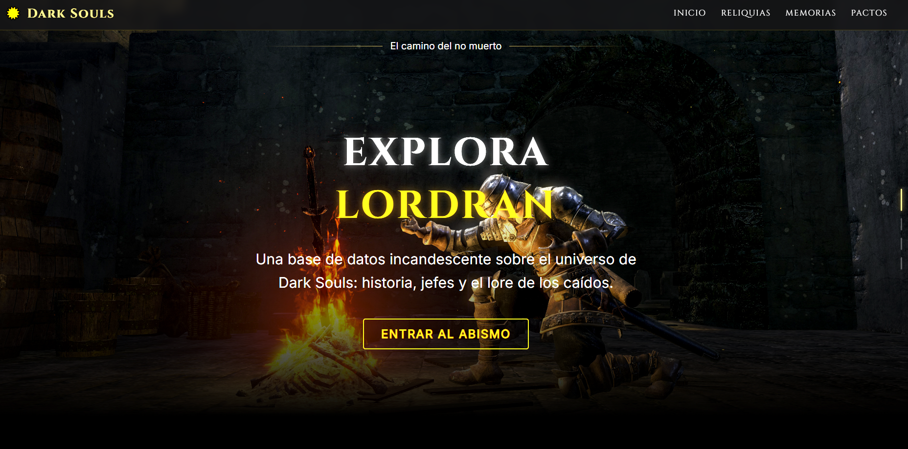

<p align="center">
  
  
  
  
</p>

# Dark Souls Hub | Lordran Database

> *"Solo en la oscuridad pueden brillar verdaderamente las almas."*

Este proyecto es una aplicación web Frontend moderna y de alto rendimiento construida con **Astro**. Funciona como una base de datos interactiva e inmersiva sobre el universo del videojuego *Dark Souls*, abarcando su historia, sus jefes legendarios y sus personajes más icónicos.

 **Mira el proyecto en vivo aquí:** [Dark Souls Hub en Vercel](https://dark-soul-web.vercel.app/)

---

<p align="center">
  
</p>

---

## Tecnologías y Arquitectura

Este proyecto fue desarrollado bajo una arquitectura moderna enfocada en el rendimiento estático y la experiencia de usuario (UX):

* **[Astro](https://astro.build/)**: Framework web principal. Su sistema de enrutamiento basado en archivos nos permite manejar múltiples secciones (Historia, Jefes) con un peso casi nulo de JavaScript.
* **TypeScript (Strict Mode)**: Para garantizar código seguro y mantenible.
* **CSS3 Moderno**: 
  * Diseño 100% Responsive sin Media Queries utilizando **CSS Grid** (`auto-fit`, `minmax`).
  * Sistemas **HEX**, **RGB/RGBA** y **HSL** combinados con variables nativas (`:root`).
  * Uso avanzado de `z-index`, `isolation` y sombras (`box-shadow`, `text-shadow`) para crear profundidad 3D y efectos de resplandor.
* **JavaScript (Vanilla)**: 
  * Implementación nativa de la API **Intersection Observer** para revelar contenido fluidamente al hacer scroll, maximizando el rendimiento.
* **CI/CD**: Despliegue continuo automatizado a través de **Vercel** conectado directamente a GitHub.

---

## Características Principales

1. **Portal Hero Inmersivo**: Video de fondo de alta resolución optimizado, con un *overlay* oscuro y navegación de anclaje suave (`scroll-behavior: smooth`).
2. **Navegación Interactiva**: Tarjetas de menú construidas con CSS Grid que incluyen efectos físicos de levitación (`transform: translateY`).
3. **Optimización SEO y Performance**: Gracias a la naturaleza de Astro, el sitio carga a velocidades extremas al entregar HTML puro por defecto.
4. **Cultura Open Source**: El repositorio actúa como una ventana al proceso de desarrollo, invitando a otros desarrolladores a explorar el código y aprender.

---

<p align="center">
  
</p>
<p align="center">
  <em>Estado actual del diseño y desarrollo de la interfaz de Lordran Hub.</em>
</p>

---

## Cómo Ejecutar el Proyecto Localmente

Si deseas explorar el código fuente en tu propia máquina, sigue estos pasos (requiere [Node.js](https://nodejs.org/)):

```bash
# 1. Clona el repositorio
git clone [https://github.com/LeaGaj04/dark-souls-hub.git](https://github.com/LeaGaj04/dark-souls-hub.git)

# 2. Entra a la carpeta del proyecto
cd dark-souls-hub

# 3. Instala las dependencias
npm install

# 4. Inicia el servidor de desarrollo
npm run dev

El sitio web estará disponible en http://localhost:4321.
```

Si este código te resultó útil o te gustó el diseño, ¡considera darle una ⭐️ al repositorio! Praise the Sun! ☀️
